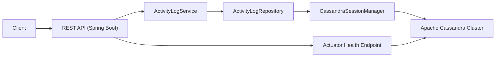

# Activity Log Service

Backend-сервис для логирования пользовательской активности на базе **Spring Boot** и **Apache Cassandra**.

Проект сфокусирован на production-приближенных аспектах для single-service приложения:

- API-first REST интерфейс с OpenAPI/Swagger
- устойчивое подключение к Cassandra с retry при старте
- автоматическая инициализация keyspace/table/index
- health-check через Spring Actuator с проверкой Cassandra
- интеграционные тесты через Testcontainers

## Highlights

- Spring Boot 3.2 + Java 17
- Cassandra-модель с оптимизацией под запросы по `user_id` и времени
- TTL на каждую запись (дефолт 30 дней, можно переопределить через API)
- Подготовленные CQL statements и кастомный repository-слой
- Централизованная обработка ошибок в REST API

## Architecture



### Как это работает

- Клиент отправляет запросы в REST-контроллер `ActivityLogController`.
- `ActivityLogService` валидирует/дополняет данные (например, ставит `timestamp=now`, если не передан).
- `ActivityLogRepository` выполняет CQL-запросы через prepared statements.
- `CassandraSessionManager` поднимает сессию, ретраит коннект и создает схему при старте.

## Engineering Notes

- Защита от нестабильного старта Cassandra: до 15 попыток подключения с задержкой.
- Хранение временных рядов по пользователю:
  - partition key: `user_id`
  - clustering keys: `timestamp DESC`, `activity_id ASC`
- Поддержка выборок:
  - все события пользователя
  - последние `N` событий
  - события в диапазоне времени
- Поддержка пользовательского TTL (`ttlSeconds`) при записи.

## Tech Stack

- **Backend:** Java 17, Spring Boot 3.2, Spring Web, Spring Validation
- **Data:** Apache Cassandra 4.1, DataStax Java Driver 4.1
- **Docs:** Springdoc OpenAPI (Swagger UI)
- **Observability:** Spring Boot Actuator (кастомный Cassandra health indicator)
- **Tests:** JUnit 5, Spring Boot Test, Testcontainers (Cassandra)
- **Build:** Maven

## Quick Start

### Prerequisites

- Java 17+
- Maven 3.8+
- Docker + Docker Compose

### 1) Запуск Cassandra

```bash
docker compose up -d
```

В `docker-compose.yml` поднимается 3-node Cassandra cluster, при этом контактная точка для приложения — `localhost:9042`.

Проверьте готовность:

```bash
docker compose exec cassandra-node1 nodetool status
```

Ожидаемое состояние: у всех нод статус `UN`.

### 2) Запуск приложения

```bash
mvn spring-boot:run
```

Сервис будет доступен на `http://localhost:8080`.

### 3) Переменные окружения (опционально)

| Variable | Description | Default |
|----------|-------------|---------|
| `CASSANDRA_CONTACT_POINTS` | Cassandra contact points (через запятую) | `127.0.0.1` |
| `CASSANDRA_PORT` | CQL port | `9042` |
| `CASSANDRA_KEYSPACE` | Keyspace | `activity_logs` |
| `CASSANDRA_DATACENTER` | Datacenter | `datacenter1` |
| `CASSANDRA_REPLICATION_FACTOR` | Replication factor | `1` |

Пример:

```bash
export CASSANDRA_CONTACT_POINTS=127.0.0.1
export CASSANDRA_PORT=9042
mvn spring-boot:run
```

## API

- Swagger UI: `http://localhost:8080/swagger-ui.html`
- OpenAPI JSON: `http://localhost:8080/api-docs`

### Key Endpoints

- `POST /api/v1/activities` — создать запись активности (body: `userId`, `activityType`, опционально `timestamp`; query: `ttlSeconds`)
- `GET /api/v1/activities/users/{userId}` — получить все активности пользователя
- `GET /api/v1/activities/users/{userId}/recent?limit=10` — получить последние активности пользователя
- `GET /api/v1/activities/users/{userId}/range?startTime=...&endTime=...` — получить активности в диапазоне времени
- `GET /actuator/health` — health-check приложения и Cassandra

### Примеры запросов

```bash
curl -X POST http://localhost:8080/api/v1/activities \
  -H "Content-Type: application/json" \
  -d '{"userId":"550e8400-e29b-41d4-a716-446655440000","activityType":"login"}'

curl "http://localhost:8080/api/v1/activities/users/550e8400-e29b-41d4-a716-446655440000"

curl "http://localhost:8080/api/v1/activities/users/550e8400-e29b-41d4-a716-446655440000/recent?limit=5"
```

## Data Model (Cassandra)

- Keyspace: `activity_logs`
- Table: `user_activities`
- Columns:
  - `user_id UUID`
  - `activity_id UUID`
  - `activity_type TEXT`
  - `timestamp TIMESTAMP`
- Primary key:
  - partition: `user_id`
  - clustering: `timestamp`, `activity_id`
- Clustering order: `timestamp DESC`, `activity_id ASC`
- Secondary index: `idx_activity_type` on `activity_type`

## Testing

Проект использует интеграционные тесты с реальной Cassandra через Testcontainers:

```bash
mvn test
```

Покрываются базовые сценарии:

- health endpoint (`/actuator/health`)
- создание activity и чтение по `userId`
- ограничение на выдачу recent-запроса (`limit`)

## Project Structure

- `src/main/java/org/example/ActivityLogApplication.java` — точка входа Spring Boot
- `src/main/java/org/example/config` — конфиг Cassandra и health indicator
- `src/main/java/org/example/web` — REST controller, DTO, обработка ошибок
- `src/main/java/org/example/service` — бизнес-логика
- `src/main/java/org/example/repository` — CQL операции
- `src/main/java/org/example/util` — управление Cassandra session и schema init
- `src/test/java/org/example/ActivityLogApiIntegrationTest.java` — интеграционные тесты API

## Troubleshooting

- Ошибка `Could not reach any contact point`:
  - проверьте, что Cassandra поднята: `docker compose ps`
  - дождитесь готовности кластера (2-3 минуты после старта)
  - проверьте статус нод: `docker compose exec cassandra-node1 nodetool status`
- Если приложение стартовало раньше Cassandra, оно выполнит retry-подключения автоматически.

## Author

Dumitru Diacenco
